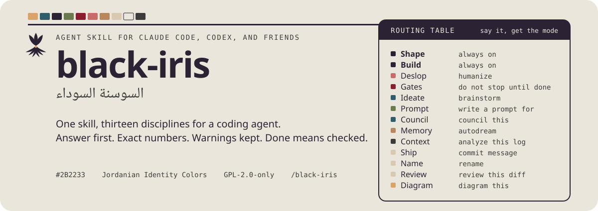

<p align="center">
<picture>
  <source media="(prefers-color-scheme: dark)" srcset=".github/assets/readme/hero-en-dark.svg">
  
</picture>
</p>

<p align="center">
<picture>
  <source media="(prefers-color-scheme: dark)" srcset=".github/assets/readme/logo-dark.svg">
  
</picture>
</p>

<h1 align="center">black-iris</h1>
<p align="center"><em>السوسنة السوداء</em></p>
<p align="center">One skill, twelve disciplines for a coding agent.</p>

<p align="center"><a href="README.md">English</a> | <a href="docs/es/README.md">Espanol</a> | <a href="docs/ar/README.md">العربية</a></p>

<p align="center">One skill for a coding agent, twelve disciplines. It shapes every reply for a reader with ADHD, cuts AI tells from anything the agent writes, keeps code changes surgical, writes completion gates before long work, fans out isolated ideation branches, writes prompts for other tools, consolidates session memory, keeps bulk data out of the context window, and handles commit text, naming, and diff review. One 200-line router plus ten reference files.</p>

<picture>
  <source media="(prefers-color-scheme: dark)" srcset=".github/assets/readme/section-install-en-dark.svg">
  
</picture>

Claude Code, plugin with the session-start hook:

```bash
claude plugin marketplace add MKAbuMattar/black-iris
claude plugin install black-iris@black-iris
```

Any agent that reads Agent Skills, skill only:

```bash
npx skills add MKAbuMattar/black-iris -g
```

Every other agent, including Codex, Kimi, Gemini CLI, OpenCode, Z Code,
DeepSeek Harness, Copilot, Zed, Hermes, Pi, Antigravity, and Cursor, is in
[docs/en/INSTALL.md](docs/en/INSTALL.md), also in
[Arabic](docs/ar/INSTALL.md) and [Spanish](docs/es/INSTALL.md).

Already installed? Updating is its own page, because `add` and `install` will
not move you to a new version: [docs/en/UPDATE.md](docs/en/UPDATE.md), also in
[Arabic](docs/ar/UPDATE.md) and [Spanish](docs/es/UPDATE.md). Every page is
indexed at [docs/](docs/README.md).

<picture>
  <source media="(prefers-color-scheme: dark)" srcset=".github/assets/readme/section-use-en-dark.svg">
  
</picture>

Type `/black-iris` once and every mode loads in full. Shape, Build, and the
Cut list stay on until you say "stop black-iris". To load one mode alone, name
it: `/black-iris deslop`, or ask with its trigger words.

| Load one mode | Or say | What it does |
|---|---|---|
| `/black-iris deslop` | "deslop", "humanize" | Remove AI tells, keep every fact |
| `/black-iris gates` | "gates", "do not stop until done" | A checkable ledger before long work |
| `/black-iris ideate` | "ideate", "brainstorm" | Isolated parallel branches, then a verdict |
| `/black-iris prompt` | "write a prompt for X" | One paste-ready prompt for a named tool |
| `/black-iris memory` | "autodream", "consolidate memory" | Harvest and verify session knowledge |
| `/black-iris ship` | "commit message", "PR body" | Conventional commits with a real why |
| `/black-iris name` | "rename", "name this" | Identifiers that read true |
| `/black-iris review` | "review this diff" | Five ranked findings, no rewrites |

Dial the length with `/black-iris lite`, `full`, or `deep`.

<picture>
  <source media="(prefers-color-scheme: dark)" srcset=".github/assets/readme/section-store-en-dark.svg">
  
</picture>

Everything per project goes under `~/.BLACK_IRIS_AGENTS/projects/<slug>/`:
gate ledgers, memory, scratch. Nothing lands in your repo or in `~/.claude`.
Set `~/.BLACK_IRIS_AGENTS/always-on` to have the Claude Code hook re-inject
the whole skill, references included, and your project's memory index at
every session start.

<picture>
  <source media="(prefers-color-scheme: dark)" srcset=".github/assets/readme/section-repo-en-dark.svg">
  
</picture>

- `skills/black-iris/` is the skill: `SKILL.md`, `references/`, `scripts/`.
- `hooks/` holds three Claude Code hooks on two events. `reinject.sh` re-injects
  the router at session start. `gates-stop.sh` refuses a stop while gates are
  unmet, and `memory-stop.sh` asks whether a session is worth harvesting. Both
  Stop hooks are off until you create their flag file; `docs/en/INSTALL.md` has each.
- Root manifests package the same skill for Codex (plugin and marketplace),
  Kimi, Qwen, Gemini, Antigravity, and Pi.
- `evals/` is the case set and runner. `evals/RESULTS.md` claims no benchmark.

Where things are going: [docs/en/ROADMAP.md](docs/en/ROADMAP.md). How to contribute:
[.github/CONTRIBUTING.md](.github/CONTRIBUTING.md). Why it is built this way:
[docs/en/DESIGN.md](docs/en/DESIGN.md) and [docs/en/PRODUCT.md](docs/en/PRODUCT.md).

Lint before committing: `python3 skills/black-iris/scripts/universal/check.py`.

License: GPL-2.0-only for the skill and the whole repo. See [.github/LICENSE](.github/LICENSE).
