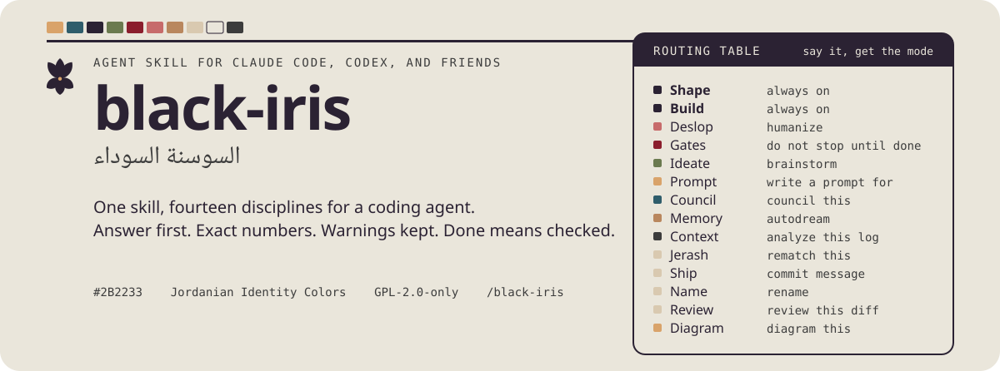

<p align="center">
<picture>
  <source media="(prefers-color-scheme: dark)" srcset=".github/assets/readme/hero-en-dark.svg">
  
</picture>
</p>

<p align="center">
<picture>
  <source media="(prefers-color-scheme: dark)" srcset=".github/assets/readme/logo-dark.svg">
  
</picture>
</p>

<h1 align="center">black-iris</h1>
<p align="center"><em>السوسنة السوداء</em></p>
<p align="center">One skill, sixteen disciplines for a coding agent.</p>

<p align="center"><a href="README.md">English</a> | <a href="docs/es/README.md">Espanol</a> | <a href="docs/ar/README.md">العربية</a></p>

<p align="center">One skill for a coding agent, sixteen disciplines. It shapes every reply for a reader with ADHD, cuts AI tells from anything the agent writes, keeps code changes surgical, writes completion gates before long work, fans out isolated ideation branches, writes prompts for other tools, consolidates session memory, hands the session across compaction, loops a task until every gate is met, keeps bulk data out of the context window, and handles commit text, naming, and diff review. One 200-line router plus ten reference files.</p>

<picture>
  <source media="(prefers-color-scheme: dark)" srcset=".github/assets/readme/section-install-en-dark.svg">
  
</picture>

Claude Code, plugin with the session-start hook:

```bash
claude plugin marketplace add MKAbuMattar/black-iris
claude plugin install black-iris@black-iris
```

Any agent that reads Agent Skills, skill only:

```bash
npx skills add MKAbuMattar/black-iris -g
```

Every other agent, including Codex, Kimi, Gemini CLI, OpenCode, Z Code,
DeepSeek Harness, Copilot, Zed, Hermes, Pi, Antigravity, and Cursor, is in
[docs/en/INSTALL.md](docs/en/INSTALL.md), also in
[Arabic](docs/ar/INSTALL.md) and [Spanish](docs/es/INSTALL.md).

Already installed? Updating is its own page, because `add` and `install` will
not move you to a new version: [docs/en/UPDATE.md](docs/en/UPDATE.md), also in
[Arabic](docs/ar/UPDATE.md) and [Spanish](docs/es/UPDATE.md). Every page is
indexed at [docs/](docs/README.md).

<picture>
  <source media="(prefers-color-scheme: dark)" srcset=".github/assets/readme/section-use-en-dark.svg">
  
</picture>

Type `/black-iris` once and every mode loads in full. Shape, Build, and the
Cut list stay on until you say "stop black-iris". To load one mode alone, name
it: `/black-iris:deslop` in Claude Code, `/black-iris-deslop` in any agent that
reads Agent Skills, or ask with its trigger words. `/black-iris:black-iris`
loads everything.

| | Claude Code | Other agents | Or say | What it does |
|---|---|---|---|---|
|  | `/black-iris:black-iris` | `/black-iris` | "black-iris" | Every mode, Shape, Build, and the Cut list |
|  | `/black-iris:deslop` | `/black-iris-deslop` | "deslop", "humanize" | Remove AI tells, keep every fact |
|  | `/black-iris:gates` | `/black-iris-gates` | "gates", "do not stop until done" | A checkable ledger before long work |
|  | `/black-iris:ideate` | `/black-iris-ideate` | "ideate", "brainstorm" | Isolated parallel branches, then a verdict |
|  | `/black-iris:prompt` | `/black-iris-prompt` | "write a prompt for X" | One paste-ready prompt for a named tool |
|  | `/black-iris:council` | `/black-iris-council` | "council this", "pressure-test this" | Five isolated advisors, anonymous review, one verdict |
|  | `/black-iris:jerash` | `/black-iris-jerash` | "race this", "try again" | 100 entrants race in heats of critique and judging; one entry holds the lane |
|  | `/black-iris:siq` | `/black-iris-siq` | "handoff", "resume where we left off" | Writes decisions, proof, and corrections before compaction and reads them back after |
|  | `/black-iris:dabke` | `/black-iris-dabke` | "loop until done", "keep going without stopping" | Loops the task step by step until every gate is met; acts only at high confidence, investigates first otherwise |
|  | `/black-iris:memory` | `/black-iris-memory` | "autodream", "consolidate memory" | Harvest and verify session knowledge |
|  | `/black-iris:context` | `/black-iris-context` | "analyze this log" | Derive answers from bulk data, never dump it |
|  | `/black-iris:ship` | `/black-iris-ship` | "commit message", "PR body" | Conventional commits with a real why |
|  | `/black-iris:name` | `/black-iris-name` | "rename", "name this" | Identifiers that read true |
|  | `/black-iris:review` | `/black-iris-review` | "review this diff" | Five ranked findings, no rewrites |

Dial the length with `/black-iris lite`, `full`, or `deep`.

<picture>
  <source media="(prefers-color-scheme: dark)" srcset=".github/assets/readme/section-store-en-dark.svg">
  
</picture>

Everything per project goes under `~/.BLACK_IRIS_AGENTS/projects/<slug>/`:
gate ledgers, memory, scratch. Nothing lands in your repo or in `~/.claude`.
Set `~/.BLACK_IRIS_AGENTS/always-on` to have the Claude Code hook re-inject
the whole skill, references included, and your project's memory index at
every session start.

<picture>
  <source media="(prefers-color-scheme: dark)" srcset=".github/assets/readme/section-repo-en-dark.svg">
  
</picture>

- `skills/black-iris/` is the skill: `SKILL.md`, `references/`, `scripts/`.
- `hooks/` holds three Claude Code hooks on two events. `reinject.sh` re-injects
  the router at session start. `gates-stop.sh` refuses a stop while gates are
  unmet, and `memory-stop.sh` asks whether a session is worth harvesting. Both
  Stop hooks are off until you create their flag file; `docs/en/INSTALL.md` has each.
- Root manifests package the same skill for Codex (plugin and marketplace),
  Kimi, Qwen, Gemini, Antigravity, and Pi.
- `evals/` is the case set and runner. `evals/RESULTS.md` claims no benchmark.

Where things are going: [docs/en/ROADMAP.md](docs/en/ROADMAP.md). How to contribute:
[.github/CONTRIBUTING.md](.github/CONTRIBUTING.md). Why it is built this way:
[docs/en/DESIGN.md](docs/en/DESIGN.md) and [docs/en/PRODUCT.md](docs/en/PRODUCT.md). How Siq
hands a session across compaction: [docs/en/SIQ.md](docs/en/SIQ.md).

Lint before committing: `python3 skills/black-iris/scripts/universal/check.py`.

License: GPL-2.0-only for the skill and the whole repo. See [.github/LICENSE](.github/LICENSE).
