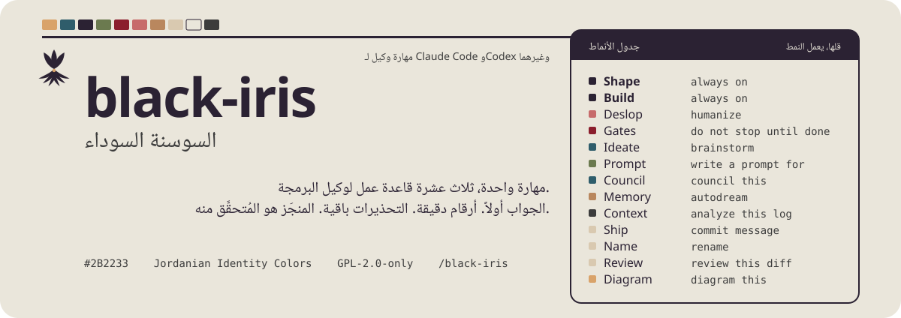

<p align="center">
<picture>
  <source media="(prefers-color-scheme: dark)" srcset=".github/assets/readme/hero-ar-dark.svg">
  
</picture>
</p>

<p align="center">
<picture>
  <source media="(prefers-color-scheme: dark)" srcset=".github/assets/readme/logo-dark.svg">
  
</picture>
</p>

<h1 align="center">black-iris</h1>
<p align="center"><em>السوسنة السوداء</em></p>
<p align="center">مهارة واحدة، اثنتا عشرة قاعدة عمل لوكيل البرمجة.</p>

<p align="center"><a href="README.md">English</a> | <a href="README_ES.md">Espanol</a> | <a href="README_AR.md">العربية</a></p>

<p align="center">مهارة واحدة لوكيل البرمجة، اثنتا عشرة قاعدة عمل. تُشكّل كل رد لقارئ لديه فرط الحركة ونقص الانتباه، وتحذف علامات النص المولَّد بالذكاء الاصطناعي من كل ما يكتبه الوكيل، وتُبقي تغييرات الكود دقيقة ومحدودة، وتكتب بوابات إنجاز قبل العمل الطويل، وتُطلق فروع أفكار معزولة، وتكتب أوامر لأدوات أخرى، وتُرتّب ذاكرة الجلسة، وتُبقي البيانات الضخمة خارج نافذة السياق، وتتولى رسائل الالتزام والتسمية ومراجعة الفروقات. موجّه من 200 سطر مع عشرة ملفات مرجعية.</p>

<picture>
  <source media="(prefers-color-scheme: dark)" srcset=".github/assets/readme/section-install-ar-dark.svg">
  
</picture>

Claude Code، إضافة مع خطاف بداية الجلسة:

```bash
claude plugin marketplace add MKAbuMattar/black-iris
claude plugin install black-iris@black-iris
```

أي وكيل يقرأ Agent Skills، المهارة فقط:

```bash
npx skills add MKAbuMattar/black-iris -g
```

بقية الوكلاء، ومنهم Codex وKimi وGemini CLI وOpenCode وZ Code وDeepSeek Harness
وCopilot وZed وHermes وPi وAntigravity وCursor، في [INSTALL.md](INSTALL.md).

<picture>
  <source media="(prefers-color-scheme: dark)" srcset=".github/assets/readme/section-use-ar-dark.svg">
  
</picture>

اكتب `/black-iris` مرة واحدة فتُحمَّل كل الأنماط كاملة. تبقى Shape وBuild
وقائمة Cut فعّالة حتى تقول "stop black-iris". لتحميل نمط واحد فقط، سمّه:
`/black-iris deslop`، أو اطلبه بكلماته المحفّزة.

| تحميل نمط واحد | أو قل | ماذا يفعل |
|---|---|---|
| `/black-iris deslop` | "deslop"، "humanize" | إزالة علامات الذكاء الاصطناعي مع الحفاظ على كل حقيقة |
| `/black-iris gates` | "gates"، "do not stop until done" | سجل قابل للتحقق قبل العمل الطويل |
| `/black-iris ideate` | "ideate"، "brainstorm" | فروع متوازية معزولة ثم حكم نهائي |
| `/black-iris prompt` | "write a prompt for X" | أمر واحد جاهز للصق في أداة محددة |
| `/black-iris memory` | "autodream"، "consolidate memory" | حصاد معرفة الجلسة والتحقق منها |
| `/black-iris ship` | "commit message"، "PR body" | التزامات اصطلاحية مع سبب حقيقي |
| `/black-iris name` | "rename"، "name this" | معرّفات صادقة في القراءة |
| `/black-iris review` | "review this diff" | خمس ملاحظات مرتبة دون إعادة كتابة |

اضبط الطول عبر `/black-iris lite` أو `full` أو `deep`.

<picture>
  <source media="(prefers-color-scheme: dark)" srcset=".github/assets/readme/section-store-ar-dark.svg">
  
</picture>

كل ما يخص المشروع يُحفظ تحت `~/.BLACK_IRIS_AGENTS/projects/<slug>/`: سجلات
البوابات، الذاكرة، الملفات المؤقتة. لا يُكتب شيء داخل مستودعك أو في
`~/.claude`. أنشئ `~/.BLACK_IRIS_AGENTS/always-on` ليُعيد خطاف Claude Code حقن
المهارة كاملة مع مراجعها وفهرس ذاكرة مشروعك عند كل بداية جلسة.

<picture>
  <source media="(prefers-color-scheme: dark)" srcset=".github/assets/readme/section-repo-ar-dark.svg">
  
</picture>

- `skills/black-iris/` هو المهارة: `SKILL.md` و`references/` و`scripts/`.
- `hooks/` هو خطاف SessionStart الخاص بـ Claude Code.
- ملفات التعريف في الجذر تُغلّف المهارة نفسها لـ Codex وKimi وQwen وGemini
  وAntigravity وPi.

افحص قبل الالتزام: `python3 skills/black-iris/scripts/universal/check.py`.

الرخصة: GPL-2.0-only للمهارة وللمستودع كله. انظر [.github/LICENSE](.github/LICENSE).
