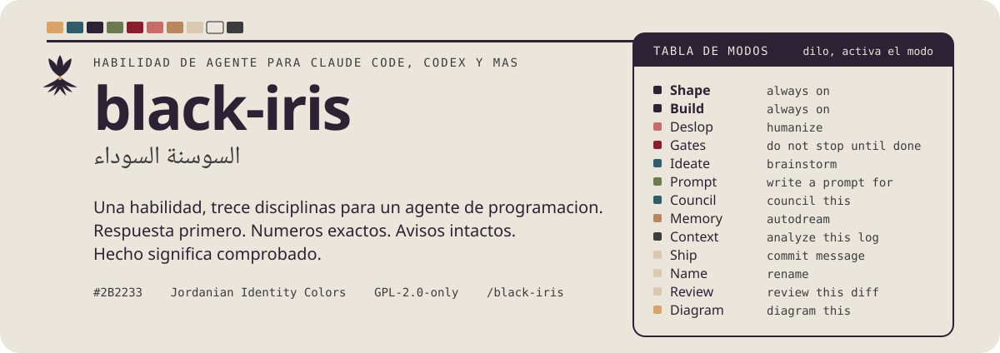
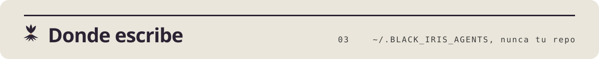

<p align="center">
<picture>
  <source media="(prefers-color-scheme: dark)" srcset=".github/assets/readme/hero-es-dark.svg">
  
</picture>
</p>

<p align="center">
<picture>
  <source media="(prefers-color-scheme: dark)" srcset=".github/assets/readme/logo-dark.svg">
  
</picture>
</p>

<h1 align="center">black-iris</h1>
<p align="center"><em>السوسنة السوداء</em></p>
<p align="center">Una habilidad, doce disciplinas para un agente de programacion.</p>

<p align="center"><a href="README.md">English</a> | <a href="README_ES.md">Espanol</a> | <a href="README_AR.md">العربية</a></p>

<p align="center">Una sola habilidad para un agente de programacion, doce disciplinas. Da forma a cada respuesta para un lector con TDAH, elimina las marcas de texto generado por IA de todo lo que el agente escribe, mantiene los cambios de codigo quirurgicos, escribe puertas de finalizacion antes de trabajos largos, lanza ramas de ideacion aisladas, redacta prompts para otras herramientas, consolida la memoria de la sesion, mantiene los datos masivos fuera de la ventana de contexto y se ocupa de los mensajes de commit, los nombres y la revision de diffs. Un enrutador de 200 lineas mas diez archivos de referencia.</p>

<picture>
  <source media="(prefers-color-scheme: dark)" srcset=".github/assets/readme/section-install-es-dark.svg">
  
</picture>

Claude Code, plugin con el hook de inicio de sesion:

```bash
claude plugin marketplace add MKAbuMattar/black-iris
claude plugin install black-iris@black-iris
```

Cualquier agente que lea Agent Skills, solo la habilidad:

```bash
npx skills add MKAbuMattar/black-iris -g
```

El resto de agentes, incluidos Codex, Kimi, Gemini CLI, OpenCode, Z Code,
DeepSeek Harness, Copilot, Zed, Hermes, Pi, Antigravity y Cursor, esta en
[INSTALL.md](INSTALL.md).

<picture>
  <source media="(prefers-color-scheme: dark)" srcset=".github/assets/readme/section-use-es-dark.svg">
  
</picture>

Escribe `/black-iris` una vez y todos los modos se cargan completos. Shape,
Build y la Cut list quedan activos hasta que digas "stop black-iris". Para
cargar un solo modo, nombralo: `/black-iris deslop`, o pidelo con sus
palabras disparadoras.

| Cargar un modo | O di | Que hace |
|---|---|---|
| `/black-iris deslop` | "deslop", "humanize" | Quita las marcas de IA, conserva cada hecho |
| `/black-iris gates` | "gates", "do not stop until done" | Un registro comprobable antes de un trabajo largo |
| `/black-iris ideate` | "ideate", "brainstorm" | Ramas paralelas aisladas y luego un veredicto |
| `/black-iris prompt` | "write a prompt for X" | Un prompt listo para pegar en una herramienta concreta |
| `/black-iris memory` | "autodream", "consolidate memory" | Cosecha y verifica el conocimiento de la sesion |
| `/black-iris ship` | "commit message", "PR body" | Commits convencionales con un porque real |
| `/black-iris name` | "rename", "name this" | Identificadores que dicen la verdad |
| `/black-iris review` | "review this diff" | Cinco hallazgos ordenados, sin reescrituras |

Ajusta la longitud con `/black-iris lite`, `full` o `deep`.

<picture>
  <source media="(prefers-color-scheme: dark)" srcset=".github/assets/readme/section-store-es-dark.svg">
  
</picture>

Todo lo que es por proyecto va a `~/.BLACK_IRIS_AGENTS/projects/<slug>/`:
registros de puertas, memoria, borradores. Nada cae en tu repositorio ni en
`~/.claude`. Crea `~/.BLACK_IRIS_AGENTS/always-on` para que el hook de Claude
Code reinyecte la habilidad completa, referencias incluidas, y el indice de
memoria de tu proyecto en cada inicio de sesion.

<picture>
  <source media="(prefers-color-scheme: dark)" srcset=".github/assets/readme/section-repo-es-dark.svg">
  
</picture>

- `skills/black-iris/` es la habilidad: `SKILL.md`, `references/`, `scripts/`.
- `hooks/` es el hook SessionStart de Claude Code.
- Los manifiestos de la raiz empaquetan la misma habilidad para Codex, Kimi,
  Qwen, Gemini, Antigravity y Pi.

Pasa el lint antes de hacer commit: `python3 skills/black-iris/scripts/universal/check.py`.

Licencia: GPL-2.0-only para la habilidad y todo el repositorio. Ver [.github/LICENSE](.github/LICENSE).
