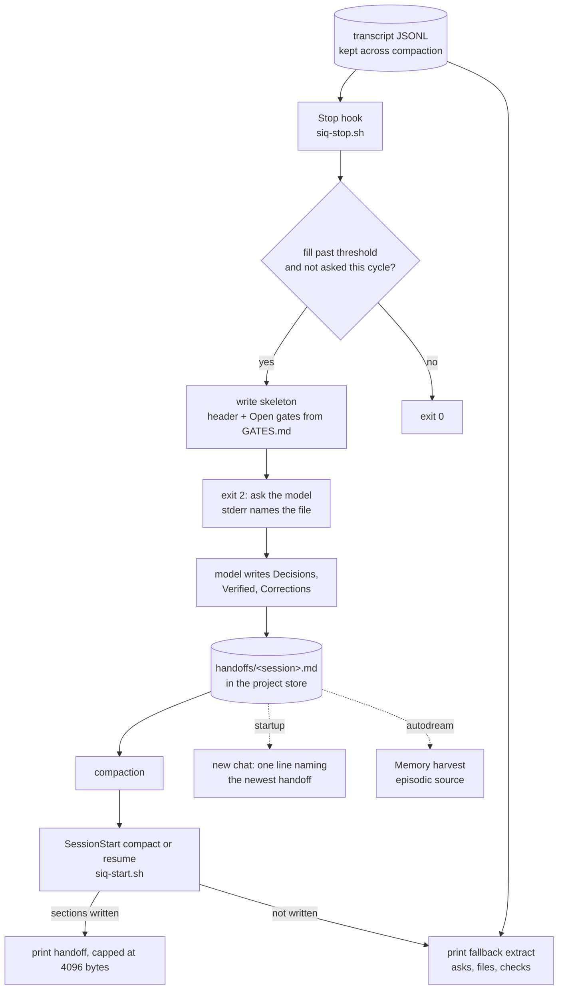

# Siq: system design


Siq is the black-iris mode that carries a session through compaction. It is
named for the Siq of Petra, the narrow gorge everything passes through to
reach the city. The icon is that gorge: two leaning walls and one petal
rising through the gap. Its tone is Petra Rose.

**One line:** a Stop hook meters the context from the transcript, asks the
model once per compaction cycle to write what the built-in summary drops,
and a SessionStart hook reads it back after compaction.

## The problem

Claude Code compacts a long session by replacing the model's view with a
summary. The summary is good at what happened: intent, files, errors, every
user message, pending tasks, the next step. It is weak at three things.

1. **Why.** The decision survives; the option it beat and the reason do
   not, so the next cycle reopens it.
2. **Proof.** "Tests pass" survives; the command and its output do not.
3. **Corrections.** The user's exact words get paraphrased, and a
   paraphrased rule loses its edge.

The summary also lives inside one transcript. A second chat on the same
project starts with none of it.

## The sweet spot

The model can only write the why while it still holds the whole session. So
the handoff has to be written **before** compaction, as late as possible and
never too late. Siq aims at about **70 percent of the context window**.

The window is not in the transcript, so Siq infers it per model:

- **1M** when that model's usage or any earlier compaction's `preTokens`
  ever passed 200k, or the model id contains `1m`. Otherwise **200k**.
- The **threshold** is the smaller of 70 percent of the window and
  85 percent of that model's last auto compaction `preTokens`. A session
  that compacted at 160k once is asked at 136k the next time.

A model switch resets the inference, because a 1M model followed by a 200k
model is common and a sticky rule asked the smaller model far too late.

**Validation.** Run over five real transcripts with 91 auto compactions,
the meter asked ahead of 88. The other 3, Opus compactions at 273k to
535k, stay unexplained; the fallback extract covers them. No extract in any slice exceeded the 4096-byte cap.

## Architecture



## Components

| Piece | Where | Job |
|---|---|---|
| `siq.py` | `skills/black-iris/siq/` | Stdlib only. Meter, extract, both hooks, enablement, prune. |
| `siq-stop.sh` | `hooks/` | Stop hook wrapper. Passes exit 2 through; any other code becomes 0. |
| `siq-start.sh` | `hooks/` | SessionStart wrapper for `startup`, `resume`, `compact`. Always exits 0. |
| `references/siq.md` | the skill | The format and rules the model follows when asked. |
| `/black-iris:siq` | `commands/siq.md` | Write the handoff now, or `arm`, `on`, `off`. |

## Data

All files live in the project store, never in the repo, `~/.claude`, or
`/tmp`:

```text
~/.BLACK_IRIS_AGENTS/
  siq-on                          every chat, every project
  projects/<slug>/
    siq-on                        every chat in this project
    siq-arm                       armed; the next Stop binds it
    siq/on-<session>              this chat only
    siq/asked-<session>-c<cycle>  asked once in this compaction cycle
    handoffs/<session>.md         one handoff per chat, newest 20 kept
```

The handoff file:

```markdown
# Siq handoff <session>

- project: <root>
- transcript: <path>
- compaction cycle: <n>
- updated: <date time>

## Decisions          (model)  chosen, rejected, why
## Verified           (model)  command and result
## Corrections        (model)  the user's words, verbatim
## Open gates (script)         unmet, not abandoned, lines from GATES.md
```

The model writes three sections; the script writes the rest. The four
sections are exactly what the built-in summary lacks. A fifth section that
repeated the summary would spend the 4096-byte read-back on text the model
already has.

## Hook contracts

- **Stop blocks through exit 2 with the reason on stderr.** That is the
  channel the hooks reference documents for Stop, and the one
  `gates-stop.sh` already uses. `stop_hook_active` is checked first, so the
  model's own reply to the ask can never be blocked again.
- **SessionStart stdout reaches the model.** PreCompact stdout does not,
  which is why Siq writes before compaction from Stop and reads after it
  from SessionStart instead of trying to act inside PreCompact.
- **Fail-open.** Every error path in `siq.py` returns 0. No `python3`
  means both wrappers exit 0. Off by default: no flag, no work beyond one
  stat per Stop.

## Failure modes

| Case | What happens |
|---|---|
| Compaction came mid-turn, no Stop crossed the threshold | SessionStart prints the extract from the last slice and asks for a rewrite. |
| The model ignored the ask | Same: the handoff sections still read `(to write)`, so the extract is printed. |
| The handoff grew past 4096 bytes | Read-back clips it and prints the full path. |
| A second compaction in the same chat | New cycle, new ask; the model merges into the same file. |
| A model switch mid-session | The meter infers the window for the current model only. |
| No hooks (a bare skill install) | `/black-iris:siq` writes the handoff by hand in the same format. |

## Rejected

- **PreCompact.** Its output does not reach the model, and at that moment
  there is no turn left to write in.
- **A per-turn summarizer.** One model call per turn to maintain a running
  handoff costs tokens on every turn for a file read once per cycle.
- **Replacing the built-in summary.** It is good at what it covers. Siq
  adds the four sections it lacks and nothing else.
- **A handoff per project instead of per chat.** Two chats would overwrite
  each other's decisions. Per chat, with the newest named at startup, keeps
  both and still lets the next chat find the last one.
