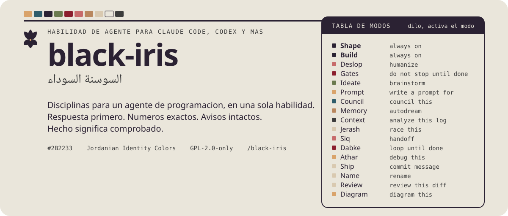
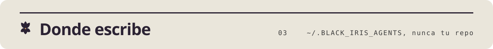

<p align="center">
<picture>
  <source media="(prefers-color-scheme: dark)" srcset="../../.github/assets/readme/hero-es-dark.svg">
  
</picture>
</p>

<p align="center">
<picture>
  <source media="(prefers-color-scheme: dark)" srcset="../../.github/assets/readme/logo-dark.svg">
  
</picture>
</p>

<h1 align="center">black-iris</h1>
<p align="center"><em>السوسنة السوداء</em></p>
<p align="center">Una habilidad, quince disciplinas para un agente de programacion.</p>

<p align="center"><a href="README.md">English</a> | <a href="README.md">Espanol</a> | <a href="../../docs/ar/README.md">العربية</a></p>

<p align="center">Una sola habilidad para un agente de programacion, quince disciplinas. Da forma a cada respuesta para un lector con TDAH, elimina las marcas de texto generado por IA de todo lo que el agente escribe, mantiene los cambios de codigo quirurgicos, escribe puertas de finalizacion antes de trabajos largos, lanza ramas de ideacion aisladas, redacta prompts para otras herramientas, consolida la memoria de la sesion, lleva la sesion a traves de la compactacion, mantiene los datos masivos fuera de la ventana de contexto y se ocupa de los mensajes de commit, los nombres y la revision de diffs. Un enrutador de 200 lineas mas diez archivos de referencia.</p>

<picture>
  <source media="(prefers-color-scheme: dark)" srcset="../../.github/assets/readme/section-install-es-dark.svg">
  
</picture>

Claude Code, plugin con el hook de inicio de sesion:

```bash
claude plugin marketplace add MKAbuMattar/black-iris
claude plugin install black-iris@black-iris
```

Cualquier agente que lea Agent Skills, solo la habilidad:

```bash
npx skills add MKAbuMattar/black-iris -g
```

El resto de agentes, incluidos Codex, Kimi, Gemini CLI, OpenCode, Z Code,
DeepSeek Harness, Copilot, Zed, Hermes, Pi, Antigravity y Cursor, esta en
[INSTALL.md](INSTALL.md).

<picture>
  <source media="(prefers-color-scheme: dark)" srcset="../../.github/assets/readme/section-use-es-dark.svg">
  
</picture>

Escribe `/black-iris` una vez y todos los modos se cargan completos. Shape,
Build y la Cut list quedan activos hasta que digas "stop black-iris". Para
cargar un solo modo: `/black-iris:deslop` en Claude Code, `/black-iris-deslop`
en cualquier agente que lea Agent Skills, o pidelo con sus palabras
disparadoras. `/black-iris:black-iris` lo carga todo.

| | Claude Code | Otros agentes | O di | Que hace |
|---|---|---|---|---|
|  | `/black-iris:black-iris` | `/black-iris` | "black-iris" | Todos los modos, Shape, Build y la Cut list |
|  | `/black-iris:deslop` | `/black-iris-deslop` | "deslop", "humanize" | Quita las marcas de IA, conserva cada hecho |
|  | `/black-iris:gates` | `/black-iris-gates` | "gates", "do not stop until done" | Un registro comprobable antes de un trabajo largo |
|  | `/black-iris:ideate` | `/black-iris-ideate` | "ideate", "brainstorm" | Ramas paralelas aisladas y luego un veredicto |
|  | `/black-iris:prompt` | `/black-iris-prompt` | "write a prompt for X" | Un prompt listo para pegar en una herramienta concreta |
|  | `/black-iris:council` | `/black-iris-council` | "council this", "pressure-test this" | Cinco asesores aislados, revision anonima, un veredicto |
|  | `/black-iris:jerash` | `/black-iris-jerash` | "race this", "try again" | 100 participantes compiten en rondas de critica y juicio; una respuesta gana la pista |
|  | `/black-iris:siq` | `/black-iris-siq` | "handoff", "resume where we left off" | Escribe decisiones, pruebas y correcciones antes de la compactacion y las lee despues |
|  | `/black-iris:memory` | `/black-iris-memory` | "autodream", "consolidate memory" | Cosecha y verifica el conocimiento de la sesion |
|  | `/black-iris:context` | `/black-iris-context` | "analyze this log" | Deriva respuestas de datos masivos, sin volcarlos |
|  | `/black-iris:ship` | `/black-iris-ship` | "commit message", "PR body" | Commits convencionales con un porque real |
|  | `/black-iris:name` | `/black-iris-name` | "rename", "name this" | Identificadores que dicen la verdad |
|  | `/black-iris:review` | `/black-iris-review` | "review this diff" | Cinco hallazgos ordenados, sin reescrituras |

Ajusta la longitud con `/black-iris lite`, `full` o `deep`.

<picture>
  <source media="(prefers-color-scheme: dark)" srcset="../../.github/assets/readme/section-store-es-dark.svg">
  
</picture>

Todo lo que es por proyecto va a `~/.BLACK_IRIS_AGENTS/projects/<slug>/`:
registros de puertas, memoria, borradores. Nada cae en tu repositorio ni en
`~/.claude`. Crea `~/.BLACK_IRIS_AGENTS/always-on` para que el hook de Claude
Code reinyecte la habilidad completa, referencias incluidas, y el indice de
memoria de tu proyecto en cada inicio de sesion.

<picture>
  <source media="(prefers-color-scheme: dark)" srcset="../../.github/assets/readme/section-repo-es-dark.svg">
  
</picture>

- `skills/black-iris/` es la habilidad: `SKILL.md`, `references/`, `scripts/`.
- `hooks/` es el hook SessionStart de Claude Code.
- Los manifiestos de la raiz empaquetan la misma habilidad para Codex, Kimi,
  Qwen, Gemini, Antigravity y Pi.

Pasa el lint antes de hacer commit: `python3 skills/black-iris/scripts/universal/check.py`.

Licencia: GPL-2.0-only para la habilidad y todo el repositorio. Ver [.github/LICENSE](../../.github/LICENSE).
